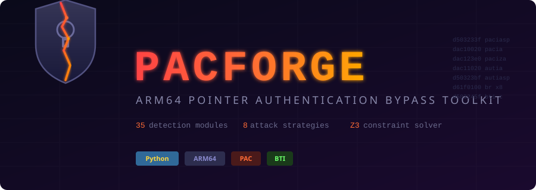

<p align="center">
  
</p>

<p align="center">
  <b>ARM64 Pointer Authentication security analysis — 35 static detection modules</b>
</p>

---

## What It Does

PACForge statically analyzes little- and big-endian ARM64 ELF binaries and Mach-O binaries (including fat/universal images) for documented Pointer Authentication (PAC) attack surfaces, misuse patterns, and mitigation coverage. Its **35 detection modules** draw on public research including Project Zero's A12 work, PACMAN, HackPac, BLASTPASS callback-oriented programming, CVE-2025-31201, and PAC-aware gadget tooling. Findings are review candidates, not automatic proof of exploitability.

### Detection Modules

ARM64 Pointer Authentication (PAC) adds a cryptographic signature to pointers — if an attacker corrupts a return address or function pointer, the CPU detects the tampered signature and faults. PACForge finds the places where this protection is incomplete or bypassable.

| # | Module | What It Finds |
|---|--------|---------------|
| 1 | **Signing Gadgets** | Locates non-prologue signing instructions and records nearby input provenance and result storage. A usable signing primitive additionally requires reachability, control of the pointer/modifier, and a way to recover or consume the result. |
| 2 | **PAC Oracles** | Finds authenticate/re-sign/store sequences that may expose authentication outcomes. Repeatable, non-crashing observation is a runtime prerequisite and is not inferred from the sequence alone. |
| 3 | **Cross-Function Chains** | Correlates sign and authentication sites with compatible key schemas and call-graph reachability. Pointer identity and value flow are not assumed. |
| 4 | **PACMAN Gadgets** | Finds short authenticate-then-memory-use sequences relevant to PACMAN-style speculative probing. Microarchitectural exploitability depends on the target CPU and runtime state. |
| 5 | **Brute-Force Feasibility** | Estimates idealized PAC search ranges from the configured VA width and target class. FPAC and timing claims require explicit target or matching-host evidence. |
| 6 | **SCTLR Manipulation** | Inventories privileged writes to PAC-related control/key registers. Their presence identifies kernel review surfaces; reachability and attacker privilege are separate questions. |
| 7 | **Data vs Instruction PAC** | Inventories instruction-key and data-key PAC use globally and per symbol-resolved function, including atomic authenticated loads (`LDRAA`/`LDRAB`) in the data-key totals. Absence of data PAC in a function is not proof that every data pointer it touches is unsigned. |
| 8 | **EL Key Separation** | Searches privileged code for known exception-level key-separation patterns. Absence of the static pattern is inconclusive and does not prove keys are shared. |
| 9 | **JOP Dispatchers** | Finds indirect-branch sequences that prepare argument registers and reports their provenance and call-graph relationships. Stack/memory provenance is potentially controllable only when a matching corruption primitive exists. |
| 10 | **Zero-Context Pairs** | Correlates zero-modifier signing and authentication within the same key family. Reuse additionally requires compatible pointer semantics and access to a valid signed value. |
| 11 | **Composability Score** | Produces a static prioritization score across signature acquisition, execution control, argument setup, and protection weakness. It is not an exploitability probability. |
| 12 | **Key Diversity** | Inventories IA, IB, DA, and DB usage to show compartmentalization. Sparse key use can widen the impact of one valid primitive but does not imply the key can be forged. |
| 13 | **Auth Pointer Inventory** | Catalogs authenticated-pointer sections and chained-fixup metadata. Reuse requires that the pointer be readable, movable, schema-compatible, and accepted at the destination. |
| 14 | **PAC Transitions** | Maps schema-compatible sign/auth sites and reports call-graph reachability plus address distance. Address distance is a ranking aid, not a temporal vulnerability metric. |
| 15 | **FPAC Status** | Reports FEAT_FPAC only from an explicit override or matching ARM64 host. FPAC is a CPU/runtime property and cannot be recovered reliably from an arbitrary binary. |
| 16 | **Coverage Analysis** | Measures symbol-resolved functions with detected return-address signing. A function lacking PAC is only one input to ROP review; BTI, canaries, GCS, CFI, and reachability still matter. |
| 17 | **Constraint Analysis** | Reports PAC operand provenance, storage/recovery requirements, callers, and heuristic or Z3 satisfiability. Solver verdicts apply only to the encoded paths and register relationships. |
| 18 | **BTI+PAC Combined** | Branch Target Identification (BTI) restricts where indirect branches can land. This module inventories which functions combine BTI landing pads with PAC return signing and which protection is absent. |
| 19 | **Auth-to-Use Window** | Counts instructions between pointer authentication and use. Separate authentication and use are review candidates; exploitability requires target-specific asynchronous state control and is not inferred from static distance alone. |
| 20 | **Context Entropy** | Measures syntactic diversity of modifier classes/registers per key and resolves constants when possible. This is not runtime entropy; SP and unresolved register values remain symbolic. |
| 21 | **Diversifier Reuse** | Groups repeated, statically resolved `(key, modifier)` signing schemas and correlates matching authentication sites. Substitution also requires compatible pointer semantics and writable/reachable storage. |
| 22 | **COP / Callback Indirection** | Finds object/structure double-dereference sequences ending in authenticated or unsigned indirect calls, as used in callback-oriented attacks. It reports first-pointer provenance but cannot prove the prerequisite type confusion or memory corruption. |
| 23 | **Fork Key Inheritance** | Separates process cloning, threading, and spawn APIs; checks call-graph reachability and verified Linux `PR_PAC_RESET_KEYS` setup. Crash-isolated brute force is conditional on actual key inheritance and failure handling. |
| 24 | **setjmp/longjmp** | Inventories non-local jump, C++ unwind, and Objective-C exception paths; estimates jmp-buffer storage and correlates PAC/zero-context use. Corruptibility and pointer substitution remain runtime questions. |
| 25 | **JIT PAC Surface** | Detects JIT framework symbols, executable-memory APIs, static RWX sections, and PAC near exports. It identifies review surfaces, not runtime W^X state or an attacker-controlled signer. |
| 26 | **Linker Signing Surface** | Detects `dlopen`/`dlsym`, interposition sections, lazy binding, and linker signing indicators associated with public oracle attacks. Presence alone does not prove attacker-controlled dyld state. |
| 27 | **Stack Protection Mode** | Classifies detected PAC return signing, stack canaries, LLVM SafeStack, and Guarded Control Stack indicators, including a per-function PAC/canary breakdown. |
| 28 | **DOP Prioritization** | Counts non-stack memory writes, tracks source provenance, and identifies symbol-resolved functions with high write-to-PAC ratios plus security-relevant globals. These are triage hints, not proof that a DOP program is viable. |
| 29 | **QARMA3 Cryptanalysis Risk** | Maps the configured VA width to the ToSC 2025 FEAT_PACQARMA3 attack table and reports possible signing surfaces. The result is conditional unless the target CPU's QARMA variant and chosen-input oracle are established; FEAT_PACQARMA5 is outside that paper's attack. |
| 30 | **Stack Pivot Gadgets** | Detects non-frame SP derivation before SP-modified authentication. Exploitability requires control of the source register and a compatible signed return value. |
| 31 | **Key Confusion** | Finds same-register sign/auth flows that switch key families within the same return or data domain. The mismatch normally causes authentication failure and is reported as a correctness/security review candidate, not a bypass by itself. |
| 32 | **Modifier Confusion** | Finds same-register data-pointer flows that switch between resolved register/constant and zero modifiers. This indicates an inconsistent schema; whether it is reachable or exploitable requires pointer-flow validation. |
| 33 | **Context Manipulation** | Finds non-restore definitions of LR/x30 before return authentication, while clearing state at calls and normal stack/frame restores. The source must still be shown attacker-influenced. |
| 34 | **Pre-Auth Pointer Loads** | Resolves indirect-branch targets loaded from authenticated and ordinary GOT/pointer sections. Authenticated sections and authenticated branches are distinguished from unsigned GOT loads and unsigned branches. |
| 35 | **XPAC Strip-and-Branch** | Detects direct `XPACI`/`XPACD`/`XPACLRI` data flow into `BR`/`BLR`/`RET` without intervening authentication, including register aliases and clobber invalidation. Ref: [HackTricks iOS exploiting](https://hacktricks.wiki/en/binary-exploitation/ios-exploiting/). |
| — | **Chain Suggestions** | Ranks eight static strategy templates by the compatible primitives observed in the binary. The ranking is a triage aid and does not establish an executable chain. |
| — | **Runtime Context** | Detects matching-host PAC/FPAC/BTI evidence and Linux kernel configuration to annotate hardware applicability. It does not establish exploitability of a different target. |

### Intelligence Features

- **Runtime context detection** — detects host architecture, OS, CPU PAC features (FEAT_PAuth, FPAC, PAuth2) and kernel PAC config; annotates hardware-dependent modules (PACMAN, brute-force, SCTLR, FPAC, EL keys) with applicability on the current host
- **VA configuration handling** — accepts `--va-bits`; otherwise uses a documented 48-bit default because link addresses do not reveal the runtime translation regime
- **Key-matched chain analysis** — cross-function chains and zero-context pairs only report matches within the same key family (A/B/DA/DB), avoiding incompatible-key pairings
- **Expanded chain review export** — 10 finding types with `provides`/`requires` metadata for chain validation: signing gadgets, oracles, JOP dispatchers, COP, unprotected functions, auth pointers, PACMAN gadgets, TOCTTOU windows, diversifier reuse, DOP targets
- **Cross-module integration** — brute-force references QARMA3 interaction; fork analysis includes conditional timing estimates; auth-window notes FPAC impact; diversifier reuse correlates matching auth sites without claiming pointer-flow proof
- **Runtime/unwinder filtering** — GCC exception unwinder PAC (`uw_update_context`, `_Unwind_*`) is separated from application-level PAC to reduce routine-generated findings
- **Function boundary awareness** — oracle and signing gadget detection respects `ret`/branch boundaries
- **Non-PAC binary detection** — reports PAC scoring as not applicable without making claims about other mitigations
- **Kernel vs userspace classification** — correct PAC bit-width estimation using kernel symbol detection
- **Lightweight call graph** — direct calls, tail calls, and statically resolved register targets support bounded reachability and caller enumeration
- **Register provenance tracking** — tracks stack, memory, constant, copy, and computed origins; provenance is evidence, not proof of attacker control
- **Mach-O metadata support** — fat32/fat64 selection, symbols/stubs, function starts, export tries, and arm64e chained-fixup metadata
- **Memoized analyses** — repeated report/JSON/review consumers reuse immutable analysis results

## Usage

```bash
# Full analysis
python3 pacforge.py ./binary --all

# Focused scans
python3 pacforge.py ./binary --signing-gadgets --oracles
python3 pacforge.py ./binary --coverage --brute-force
python3 pacforge.py ./binary --jop --composability
python3 pacforge.py ./binary --chain-suggest

# Deep analysis (CFG + constant propagation + indirect call resolution)
python3 pacforge.py ./binary --all --deep-analysis

# Cross-binary analysis (resolve imports against companion libraries)
python3 pacforge.py ./binary --all --deep-analysis --libs ./extracted_dylibs/

# Symbolic analysis (inter-procedural data flow + Z3 constraint solving)
python3 pacforge.py ./binary --constraints --symbolic

# JSON report
python3 pacforge.py ./binary --json > report.json
```

### All Flags

```
--all              Run every analysis module
--signing-gadgets  PAC signing gadgets with controllability rating
--oracles          PAC oracle patterns (auth→sign→store)
--cross-chains     Cross-function chain analysis
--pacman           PACMAN speculative gadgets
--brute-force      Brute-force feasibility + FPAC check
--sctlr            SCTLR / key register manipulation
--data-pac         Data vs instruction PAC split
--el-keys          EL key separation patterns
--jop              JOP dispatcher detection
--zero-ctx         Zero-context pair correlation
--composability    Composability scoring (0–100)
--keys             Key diversity analysis (IA/IB/DA/DB)
--inventory        Authenticated pointer inventory (__auth_got/__auth_ptr)
--transitions      Cross-function PAC transition map
--fpac             FPAC (FEAT_FPAC) detection
--coverage         Return address signing coverage (% functions)
--constraints      Signing gadget constraint analysis
--bti              BTI + PAC combined analysis
--auth-window      Auth-to-use TOCTTOU window analysis
--ctx-entropy      Context/modifier entropy analysis
--div-collisions   Diversifier collision (pointer substitution)
--cop              Callback-oriented programming (BLASTPASS)
--fork-keys        Fork/thread key inheritance
--setjmp           setjmp/longjmp PAC analysis
--jit              JIT / dynamic code PAC surface
--linker-oracle    Dynamic linker signing oracle
--stack-mode       Stack protection mode (PAC vs canaries)
--dop              Data-oriented programming surface
--qarma3           QARMA3 differential cryptanalysis risk
--stack-pivot      Stack pivot gadget detection (SP modification before auth)
--key-confusion    Key A/B sign-auth mismatch detection
--modifier-confusion  Register vs zero modifier mismatch detection (data domain)
--context-manip    LR/x30 modification before auth detection
--preauth-load     Pre-authenticated pointer load detection
--xpac-bypass      XPAC strip-and-branch detection (strip without auth before BR/BLR/RET)
--chain-suggest    Exploit chain strategy suggestions
--runtime-ctx      Host arch/OS/CPU PAC feature detection + module applicability
--json             Full analysis as JSON
--deep-analysis    Enable CFG, constant propagation, indirect call resolution, def-use chains
--symbolic         Inter-procedural data flow + Z3 constraint solving (with --deep-analysis)
--libs DIR         Companion library directory for cross-binary call resolution (with --deep-analysis)
--verbose / -v     Extra output

--export-findings FILE   Export all findings to annotation-ready JSON
--import-review FILE     Import annotated review, validate chains, generate suppressions
--suppress FILE          Suppress findings by address/function (from import-review)
```

### Chain Review Workflow

```bash
# 1. Export findings with chain metadata
python3 pacforge.py binary --all --export-findings review.json

# 2. Edit review.json: set status (confirmed/false-positive/wontfix),
#    assign chain names and step ordering

# 3. Import and validate chains
python3 pacforge.py binary --import-review review.json
#    → validates chain transitions (provides → requires)
#    → identifies missing primitives with hints
#    → generates suppression file from false-positives

# 4. Re-run with suppressions
python3 pacforge.py binary --all --suppress review_suppress.json
```

## Example Output

### PAC-Protected Binary

```
======================================================================
  PAC Analyzer — pac_binary
======================================================================
  Total instructions disassembled: 64
  Functions with symbols: 10
  PAC instructions total: 12

  Return Address Signing Coverage
  30.0% PAC coverage (3/10 functions).
  7 symbol-resolved functions lack detected return signing; review other mitigations.

  Signing Gadgets: 3 found
  0x40004c in sign_gadget [EASY]
  PAC: pacia | Controlled: x1, x0
  Stores result: True → x0, [sp, #0x20]

  PAC Oracles: 1 found
  0x400060 in oracle_sim
  Chain: autia → paciza
  Result: x0, [sp, #0x30]

  Composability Score: 90/100
  HIGH — most components for full PAC bypass chain present

  Chain Suggestions
  STRATEGY 1 — PAC Oracle (Project Zero style)
  STRATEGY 2 — Direct Signing Gadget
  STRATEGY 3 — Pre-Authenticated Pointer Reuse
```

### Non-PAC Binary

```
  Key Diversity
  No application-level PAC keys.
  (2 additional PAC instructions in runtime/unwinder — not application-level)

  Chain Suggestions
  No application-level PAC instructions were observed.
  PAC bypass scoring is not applicable; review other mitigations separately.

  Composability Score: N/A
  N/A — no application-level PAC protection.
```

## Testing

### Synthetic Binaries (no cross-compiler needed)

ELF and Mach-O test binary generators produce minimal ARM64 binaries with hand-encoded PAC instructions:

```bash
cd tests
python3 gen_test_binary.py           # ELF with PAC gadgets, oracles, JOP, COP
python3 gen_test_macho.py            # Mach-O with PAC gadgets, RETAA, __auth_ptr
python3 gen_test_improvements.py     # ELF exercising detection improvements
python3 gen_test_improvements_macho.py  # Mach-O variant of the above
python3 ../pacforge.py pac_test_binary --all
python3 ../pacforge.py pac_test_macho --all
python3 ../pacforge.py pac_test_improvements --jop --fork-keys --dop --data-pac
python3 ../pacforge.py pac_test_improvements_macho --jop --fork-keys --dop --data-pac
```

The regression suite generates its fixtures automatically:

```bash
python3 -m unittest discover -s tests -p "test_*.py" -v
```

### Compiled Test Binaries (macOS arm64e)

Source files in `tests/sources/` build realistic Mach-O binaries exercising vtables, callbacks, ObjC runtime, Swift protocols, and more. Requires a macOS arm64e host or CI runner:

```bash
# C — vtable callbacks, fork, setjmp, dlopen, mmap
clang -arch arm64e -o edge_arm64e tests/sources/pac_macho_test.c -lpthread -ldl

# C — stripped (no symbols)
clang -arch arm64e -o edge_stripped tests/sources/pac_macho_test.c -lpthread -ldl
strip edge_stripped

# C — dylib
clang -arch arm64e -shared -o edge_dylib.dylib tests/sources/pac_macho_test.c -lpthread -ldl

# C — fat/universal binary
clang -arch arm64e -o /tmp/arm64e tests/sources/pac_macho_test.c -lpthread -ldl
clang -arch arm64 -o /tmp/arm64 tests/sources/pac_macho_test.c -lpthread -ldl
lipo -create /tmp/arm64e /tmp/arm64 -output edge_fat_universal

# C — debug symbols (DWARF)
clang -arch arm64e -g -O0 -o edge_debug tests/sources/pac_macho_test.c -lpthread -ldl

# C — LTO optimized
clang -arch arm64e -O3 -flto -o edge_lto tests/sources/pac_macho_test.c -lpthread -ldl

# C — pac-ret + leaf functions (no frame pointers)
clang -arch arm64e -mbranch-protection=pac-ret+leaf -o edge_leaf tests/sources/pac_macho_test.c -lpthread -ldl

# C — framework-linked
clang -arch arm64e -o edge_framework tests/sources/pac_macho_test.c -lpthread -ldl -framework Security -framework CoreFoundation

# C++ — vtables, RTTI, exceptions, function pointers
clang++ -arch arm64e -std=c++17 -o edge_cpp tests/sources/pac_cpp_test.cpp -ldl

# Objective-C — message dispatch, blocks, runtime swizzling, KVO
clang -arch arm64e -o edge_objc tests/sources/pac_objc_test.m -framework Foundation -ldl -fobjc-arc

# Swift — protocol witnesses, closures, posix_spawn
swiftc -target arm64e-apple-macos14.0 -o edge_swift tests/sources/pac_swift_test.swift
```

The compile lines above are reproducible on an Apple Silicon macOS host. The repository's synthetic fixtures cover the corresponding parser and detector behavior on every CI platform.

### iOS Kernel Binaries (via ipsw)

Extract real iOS kernel extensions for testing against production PAC patterns:

```bash
# Install ipsw
brew install blacktop/tap/ipsw      # macOS
# or download from https://github.com/blacktop/ipsw/releases

# Download kernelcache (works on any OS — no DMG mounting needed)
ipsw download ipsw --device iPhone16,1 --kernel -o ./ipsw_dl

# Extract individual kexts
ipsw kernel extract kernelcache.release.iPhone16,1 \
    com.apple.security.sandbox \
    com.apple.driver.AppleSEPManager \
    com.apple.iokit.IOUSBDeviceFamily

# Analyze
python3 pacforge.py com.apple.security.sandbox --all
```

### iOS Usermode Binaries (via ipsw, macOS only)

Extract dyld_shared_cache entries — requires macOS for DMG mounting:

```bash
# Download IPSW (~8GB)
ipsw download ipsw --device iPhone16,1 --latest -o ./ipsw_dl

# Extract dyld_shared_cache
ipsw extract --dyld --dyld-arch arm64e -o ./dsc_out iPhone16,1_*.ipsw

# Extract specific dylibs
ipsw dyld extract ./dsc_out/*/dyld_shared_cache_arm64e \
    /usr/lib/system/libsystem_kernel.dylib
ipsw dyld extract ./dsc_out/*/dyld_shared_cache_arm64e \
    /System/Library/Frameworks/Security.framework/Security
ipsw dyld extract ./dsc_out/*/dyld_shared_cache_arm64e \
    /System/Library/Frameworks/CoreFoundation.framework/CoreFoundation

# Analyze
python3 pacforge.py libsystem_kernel.dylib --all
```

The `ios-usermode-test.yml` workflow automates this extraction and analysis pipeline; trigger it with GitHub Actions `workflow_dispatch`.

## Requirements

```bash
python3 -m pip install -r requirements.txt
python3 -m pip install -r requirements-symbolic.txt  # adds Z3
```

- **capstone** >= 5.0 — ARM64 disassembly with Pointer Authentication instruction support
- **pyelftools** >= 0.29 — required for validated ELF parsing and symbol resolution
- **z3-solver** >= 4.12 — optional: SMT solver for `--symbolic` constraint analysis. Without it, `--symbolic` falls back to a heuristic solver.
- **Python** >= 3.9

## Research Sources

Built from analysis of:

| Source | Key Contribution |
|--------|-----------------|
| [Project Zero — A12 PAC](https://googleprojectzero.blogspot.com/2019/02/examining-pointer-authentication-on.html) | Signing gadgets, oracles, SCTLR bits, EL key separation |
| [PACMAN — MIT (2022)](https://pacmanattack.com/) | Speculative TLB probing, ~55K gadgets in XNU |
| [HackPac — DEF CON 27](https://av.tib.eu/media/47654) | Cross-process shared keys, JOP dispatchers, PAC-gadget tool |
| [BabyPAC — StarCTF 2021](https://blog.bi0s.in/2021/01/30/Pwn/BabyPac/) | Full exploit chain, PACIA/PACDA forgery |
| [Jamf tfp0 on PAC iOS](https://www.jamf.com/blog/pac-a-mac-tfp0/) | Kernel PAC bypass, data-only exploitation |
| [ret2.io PAC intro](https://www.ret2.io/2021/09/08/pointer-authentication/) | Signing gadget patterns, context values |
| [BLASTPASS / NSO FORCEDENTRY](https://googleprojectzero.blogspot.com/2022/12/exploiting-CVE-2022-42856.html) | Callback-Oriented Programming (COP), unsigned callback struct indirection |
| CVE-2025-31201 (RPAC) | Diversifier collision / pointer substitution — same (key, modifier) = interchangeable |
| CVE-2024-27834 (Safari Pwn2Own) | JIT PAC surface — JSC JIT gadgets for PAC bypass |
| [GoFetch / DMP](https://gofetch.fail/) | Data Memory-dependent Prefetcher interaction with PAC |
| [Pixel 10 PAC canaries](https://security.googleblog.com/) | PAC-as-stack-canary mode, init function overwrite targets |
| [Avanzi et al. — QARMA3 Cryptanalysis (ToSC 2025)](https://doi.org/10.46586/tosc.v2025.i1.380-419) | Differential cryptanalysis of FEAT_PACQARMA3 (8-round QARMA-64): key recovery for ≥48-bit VA |
| [HackTricks — iOS Exploiting](https://hacktricks.wiki/en/binary-exploitation/ios-exploiting/) | XPAC strip-and-branch pattern — strip PAC bits without authenticating then branch |

## Resources

- [pacrops](https://github.com/gracecondition/pacrops) — independent Rust PAC-aware gadget finder used as a research and validation resource. PACForge does not wrap or replace it; the tools use different extraction strategies, heuristics, and output models.

## Known Limitations

PACForge is a static analyzer. Always-on passes handle direct/tail/static-register calls and local provenance. `--deep-analysis` adds CFG/ICFG construction, cross-block provenance, constant propagation, def-use enumeration, indirect targets, and optional companion libraries. `--symbolic` automatically enables those passes and adds caller propagation to four levels plus Z3 solving when `z3-solver` is installed. The remaining boundaries are explicit:

| Limitation | Affected Modules | Impact |
|-----------|-----------------|--------|
| **Call graph is incomplete for runtime dispatch** | Chains, JOP, Fork | Direct `BL`, `B` tail calls, static ADRP/ADD register targets, deep GOT loads, and symbol-matched companion-library graphs are supported. Runtime vtables, Objective-C dispatch, `dlsym` results, and arbitrary computed targets are not. |
| **Provenance is bounded and path-insensitive outside the solver** | JOP, Constraints, DOP | Local state reaches the control-flow boundary, deep mode follows three predecessor layers, and symbolic caller propagation reaches four call levels. Priority merging intentionally keeps the least-constrained source and can hide path-specific restrictions. Stack/memory origin alone does not prove attacker control. |
| **Constraint model is deliberately small** | Constraints | Z3 checks up to 32 CFG paths over four predecessor layers and detects direct 64-bit arithmetic/copy dependencies. It does not encode branch predicates, memory contents, heap aliasing, ABI return summaries, or general instruction semantics; infeasible CFG paths may therefore be considered. |
| **No PSTATE.BTYPE tracking** | BTI | BTI analysis counts landing-pad types but cannot track `PSTATE.BTYPE` through indirect branch sequences. Some BTI-compatible targets may be unreachable due to BTYPE mismatch. |
| **Register diversity ≠ value diversity** | Entropy | Entropy analysis measures how many *distinct registers* appear as modifiers, not how many distinct *runtime values* they hold. `--deep-analysis` resolves some modifiers to concrete values via constant propagation, but inter-procedural values and runtime SP remain symbolic. |
| **No type system integration** | COP | COP detection finds struct→function-pointer indirection patterns but cannot link them to C++ type confusion or use-after-free — the prerequisite corruption for most real COP attacks. |
| **No runtime state** | SCTLR, Fork, JIT | Whether PAC is actually enabled (SCTLR), whether fork re-keys, and whether JIT emits PAC-signed code depend on runtime state. `--runtime-ctx` partially addresses this on the host machine. |
| **No speculative execution modeling** | PACMAN | PACMAN gadgets use a fixed 6-instruction window approximation. Real speculative depth depends on microarchitecture, branch predictor state, and memory latency. |
| **Indirect branch targets partially resolved** | JOP, BTI | Deep mode resolves address chains and one known-data pointer load. Runtime-base and double-dereference vtables remain unresolved. |
| **Heap layout unknown** | COP, setjmp, DOP | Whether a jmp_buf or callback struct is adjacent to an overflowable buffer is a heap-layout question that requires dynamic analysis. |
| **No W^X / mprotect policy check** | JIT | JIT surface detection finds RWX sections and PAC-near-exports but cannot determine whether the OS enforces W^X at runtime. On iOS, the JIT exception is limited to WebKit's JSC. |
| **No dyld stub binding / resolver** | Linker oracle | Linker oracle detection finds `dlopen`/`dlsym` and lazy stubs but does not model dyld's actual stub binding or resolver behavior. |
| **Store count inflated in DOP** | DOP | Both the global store-to-PAC ratio and per-function hotspot detection exclude stack-relative stores (sp-based), but remaining non-stack stores may still target local struct fields or callee-saved register spills that are not attacker-reachable. The ratio is a *ceiling*, not a precise DOP surface measure. |
| **Cross-binary data flow stops at the ABI boundary** | All | `--libs DIR` loads companion exports and namespaced internal call graphs, allowing call reachability into a provider. Register/memory provenance is not propagated through companion implementations, and PAC key/modifier compatibility still requires review. |

### Implemented Analysis Passes

Beyond pattern matching, PACForge includes nine lightweight analysis passes (Z3 optional for constraint solving):

| Pass | Mode | What It Does | Modules | Limitations |
|------|------|-------------|---------|-------------|
| **Call graph** | Always on | Adds direct `BL`, `B`-to-entry tail calls, and statically resolved ADRP+ADD `BR`/`BLR` edges. | Bounded chain/fork reachability and signing-site callers. | Runtime-computed dispatch is unresolved; deep mode and `--libs` add only the statically recoverable subset. |
| **Register provenance** | Always on; extended by deep/symbolic modes | Tracks stack, memory, constant, copy, computed, and return-address origins to the nearest control-flow boundary. Deep mode merges three CFG predecessor layers; symbolic mode traces all callers up to four levels. | JOP argument and signing-constraint evidence. | Merged provenance is a conservative prioritization and does not itself establish attacker control. |
| **CFG and ICFG** | `--deep-analysis` | Builds intra-function basic blocks plus direct-call entry and return edges. | CFG reachability annotations for transitions and auth-to-use findings. | Indirect-call returns and exception/unwind edges are not modeled. |
| **Intra-function def-use enumeration** | `--deep-analysis` | BFS-walks reachable blocks and records exact register reads/writes. | Adds def-use evidence to data-pointer auth-to-use findings. | One function and 50 events per query; no memory SSA or alias model. |
| **Constant propagation** | `--deep-analysis` | Propagates immediate values through MOV/MOVK/MOVZ/ADD chains. Resolves PAC modifier registers to concrete values. Preserves callee-saved registers (x19–x28) across BL calls; clears all caller-saved registers (x0–x18). | Concrete modifier values (e.g. `x17=0xcbed`). Concrete diversifier collision detection. | Resets caller-saved registers at BL; does not propagate callee return values. |
| **Indirect call resolution** | `--deep-analysis` | Resolves BR/BLR targets from ADRP+ADD sequences and ADRP+ADD+LDR chains (reading pointer values from GOT/data sections, stripping PAC bits). Extends call graph with resolved targets. | JOP dispatchers annotated with `/target:func_name`. Call graph gains indirect edges. GOT-based and single-dereference vtable lookups resolved. | Double-dereference vtable chains (`ldr x8, [x0]; ldr x8, [x8, #N]` where x0 is runtime) not resolved. |
| **Cross-binary call resolution** | `--deep-analysis --libs DIR` | Matches imports to companion exports and namespaces each companion's internal call graph. | Reachability can continue from an imported symbol into the provider's direct-call graph. | No cross-binary register or memory summaries; duplicate export names use the first sorted provider. |
| **Inter-procedural data flow** | `--symbolic` | Finds x0–x7 read-before-def inputs and traces them through every direct caller/callsite to four levels. | Dispatcher and signing inputs gain caller provenance. | Tail-call operands are supported, but indirect callers, recursion, return values, and ABI side effects are not summarized. |
| **Symbolic constraint solver** | `--symbolic` | Uses Z3 self-composition to test functional independence over as many as 32 CFG provenance paths; falls back to source grouping without Z3. | Reports satisfiable, dependent, partial, fixed, or unknown constraints. | Branch guards, heap aliases, memory values, and most instruction semantics are absent; results apply only to the encoded model. |

### Out of Scope

- **Whole-program symbolic execution** — path predicates, a memory model, Objective-C/runtime dispatch, and environment state belong in a dedicated engine such as angr or Ghidra. `--export-findings` supplies focused starting points.
- **CPU emulation** — concrete execution needs a loader, mappings, keys, kernel/runtime state, and realistic inputs that a standalone static binary does not provide.

## License

MIT
